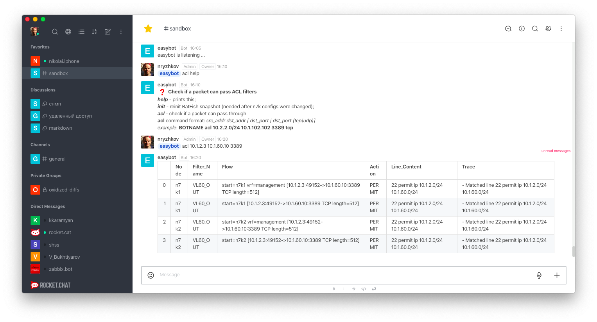

# NetOp Bot for rocket.chat

the bot is intended to help in a system network operations.  
the very first function that has been released is **acl**.  
**acl** checks if a given packet can pass throuth some ACLs. 

That how it looks in an action:  


**acl** uses the **batfish** under the hood.

----

## deployment

Application consists of two modules: Bot and backend.

Bot interacts with rocket.chat while the backend interacts with the batfish.

And finally Bot send requests to backend via GET/POST http requests.

### 1. Bot 

Bot is a nodejs application. It uses rocket.chat SDK and a node-fetch module. To run Bot first you have to install that modules under Bot directory.

```
cd bot
npm init -y
npm install @rocket.chat/sdk
npm install node-fetch --save
```
next open up *easybot.js* file in editor and change chatbots url and credentials

now you can run bot just typing:
```
node easybot.js
```

### 2. Backend

Backend is a python application that uses the FastAPI framework and the pybatfish library. 
Note: py-batfish comes with pandas (Data analysisi library) version 0.26.x, but the application uses the function .to_markdown() that appeared since version 1.0.0. So packages must be installed in order: first install pybatfish, next - pandas.

```
pip3 install pybatfish
pip3 install --upgrade pandas
```
and install fastAPI as well:
```
pip3 install fastapi
pip3 install uvicorn
```
now run batfish in a docker container:
```
docker run --name batfish -v batfish-data:/data -p 8888:8888 -p 9997:9997 -p 9996:9996 batfish/allinone
```

It's time to make sure batfish is working 
to do that you have to prepare network configuration files and place them under the directory
> backend/bf_snapshots/networks/configs

then run interactive python (ipython or bpython) and excute the following code:
```
import pandas as pd
from pybatfish.client.commands import *
from pybatfish.datamodel import *
from pybatfish.datamodel.answer import *
from pybatfish.datamodel.flow import *
from pybatfish.question import *
from pybatfish.question import bfq
load_questions()
bf_session.host = 'localhost'
bf_set_network('bf1')
bf_init_snapshot('./bf_snapshots/networks', 'snapshot-01', overwrite=True)
```

batfish should find the configs and then a snapshot should be created.

to run backend just type the command:
> python3 main.py
